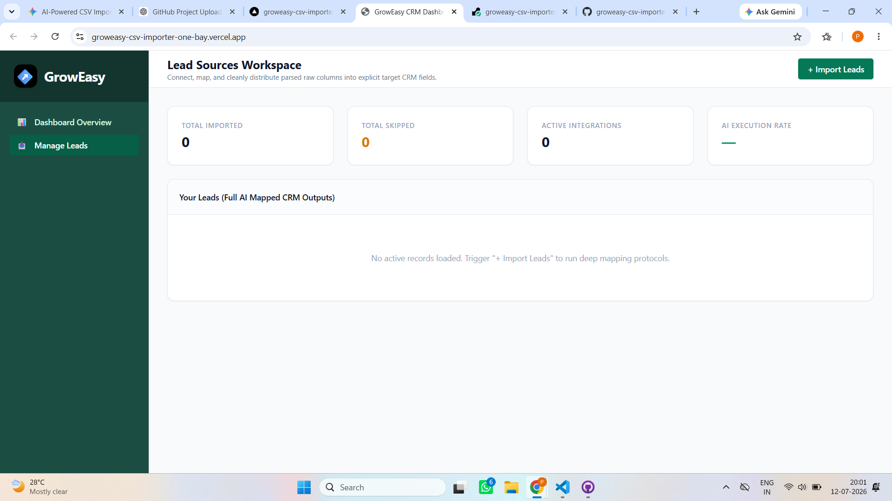
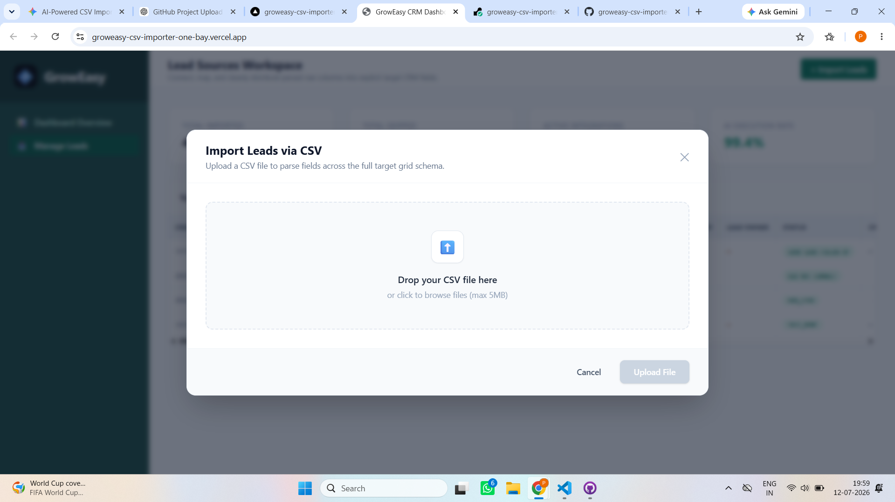
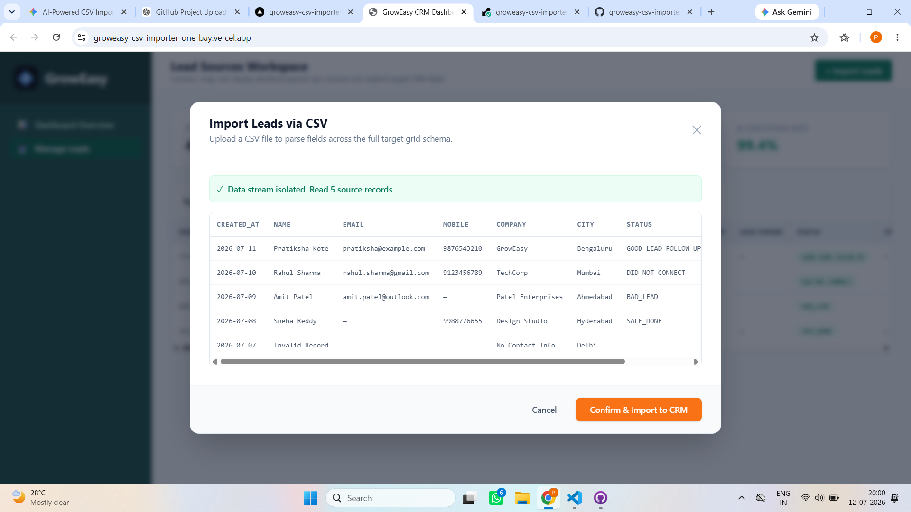
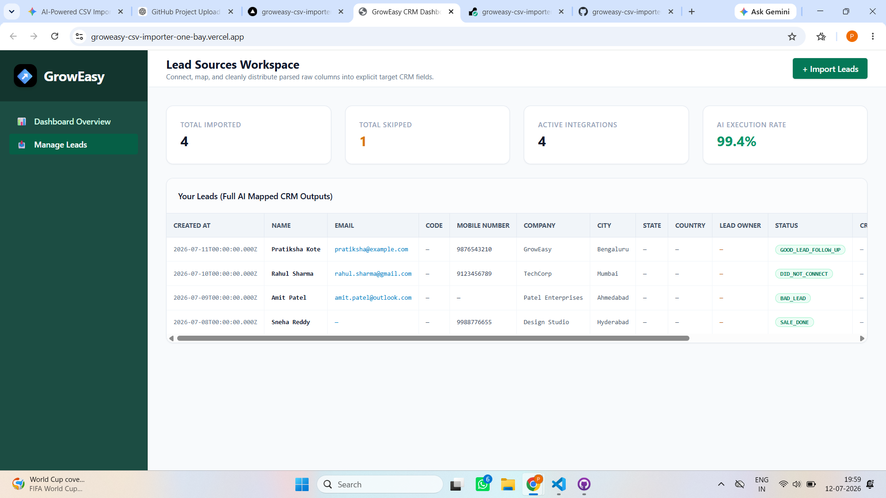

# 🚀 GrowEasy CSV Importer

An AI-powered CSV Lead Importer built with **Next.js**, **Node.js**, and **Express.js**. The application enables users to upload CSV files, preview parsed lead data, validate records, and import them into a CRM dashboard with a clean and responsive interface.

---

## 🌐 Live Demo

### Frontend (Vercel)
https://groweasy-csv-importer-one-bay.vercel.app

### Backend API (Render)
https://groweasy-csv-importer-54w2.onrender.com

### GitHub Repository
https://github.com/pratiksha123-sys/groweasy-csv-importer

---

# ✨ Features

- 📂 CSV File Upload
- 👀 Preview Imported Records
- ✅ Record Validation
- 📊 Dashboard Overview
- 👥 Lead Management
- ⚡ Fast API Integration
- 🌐 Responsive UI
- ☁️ Cloud Deployment using Vercel & Render

---

# 🛠️ Tech Stack

### Frontend
- Next.js
- React.js
- Tailwind CSS

### Backend
- Node.js
- Express.js

### Deployment
- Vercel
- Render

### Version Control
- Git & GitHub

---

# 📁 Project Structure

```
groweasy-csv-importer
│
├── frontend/
│   ├── app/
│   ├── components/
│   ├── utils/
│   └── package.json
│
├── backend/
│   ├── src/
│   │   ├── controllers/
│   │   ├── services/
│   │   ├── utils/
│   │   ├── routes.js
│   │   └── server.js
│   └── package.json
│
└── README.md
```

---

# ⚙️ Installation

## Clone Repository

```bash
git clone https://github.com/pratiksha123-sys/groweasy-csv-importer.git

cd groweasy-csv-importer
```

---

## Backend Setup

```bash
cd backend

npm install

npm start
```

Runs on:

```
http://localhost:5001
```

---

## Frontend Setup

```bash
cd frontend

npm install

npm run dev
```

Runs on:

```
http://localhost:3000
```

---

# 🔑 Environment Variables

## Backend

Create a `.env` file inside the backend folder.

```env
PORT=5001
```

---

## Frontend

Create a `.env.local` file inside the frontend folder.

```env
NEXT_PUBLIC_API_URL=http://localhost:5001
```

For production:

```env
NEXT_PUBLIC_API_URL=https://groweasy-csv-importer-54w2.onrender.com
```

---

# 🚀 Usage

1. Open the application.
2. Click **Import Leads**.
3. Upload a CSV file.
4. Preview the parsed records.
5. Validate the imported data.
6. Click **Confirm & Import to CRM**.
7. View imported records on the dashboard.

---

## 📸 Screenshots

### Dashboard


### Upload CSV


### Preview Imported Data


### CRM Table


# 📌 Future Improvements

- User Authentication
- Database Integration
- Bulk Import Support
- Search & Filters
- Export CSV
- AI Field Mapping
- Import History
- Role-Based Access

---

# 👩‍💻 Author

**Pratiksha Kote**

GitHub:
https://github.com/pratiksha123-sys

---

# 📄 License

This project was developed as part of a technical assessment and is intended for learning and evaluation purposes.
